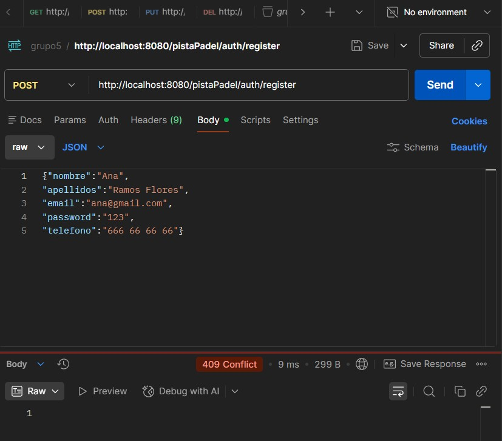
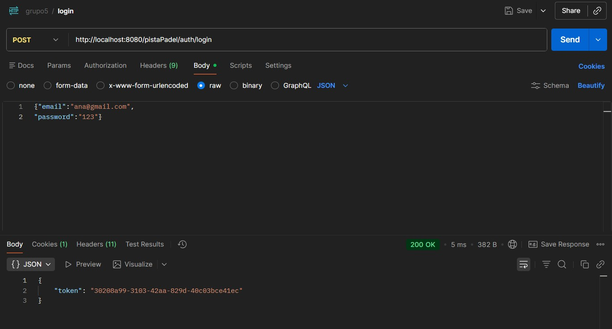
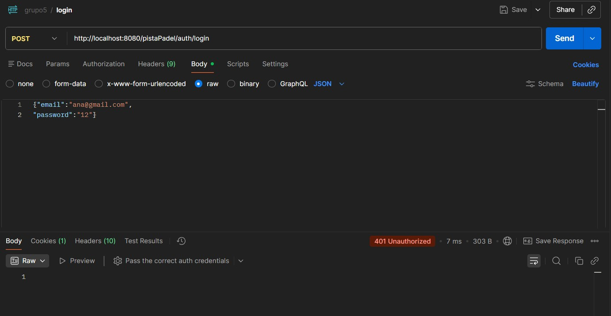
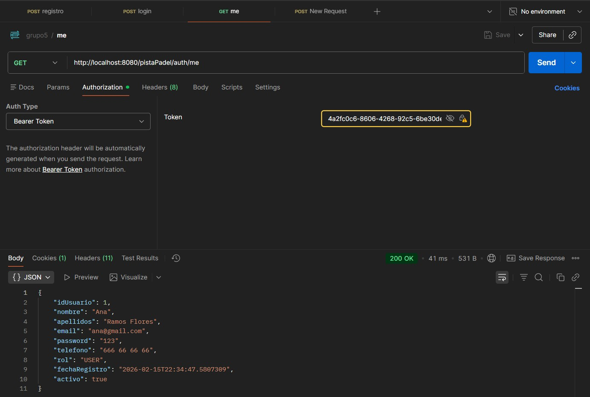
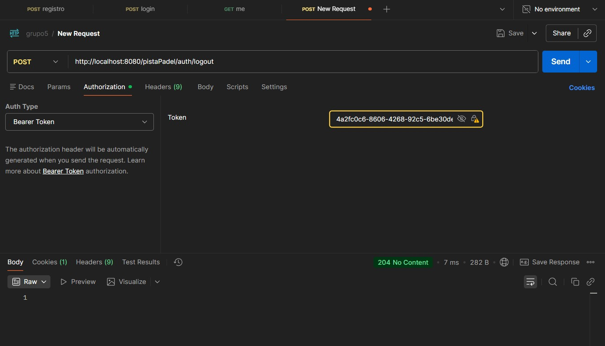
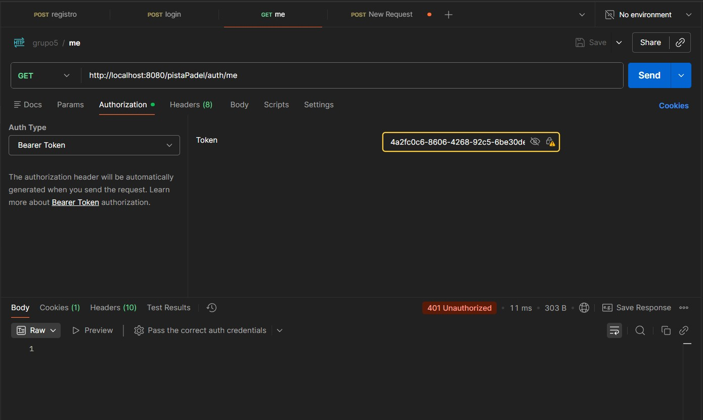
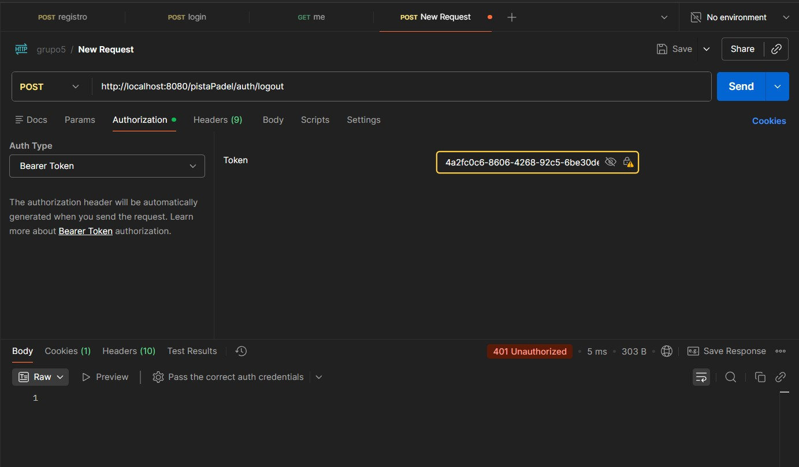

# g5-project
Final Project of PAT by group 5 


Endpoints created

POST /pistaPadel/courts
GET /pistaPadel/courts
GET /pistaPadel/courts/{courtId}
PATCH /pistaPadel/courts/{courtId}
DELETE /pistaPadel/courts/{courtId}

I created a record named Pista and added endpoints to the REST controller. In the class ConfigSeguridad I created two possible user authentications: USER and ADMIN which have different authorities to change details in the different courts. 


Endpoints created

POST /pistaPadel/courts
GET /pistaPadel/courts
GET /pistaPadel/courts/{courtId}
PATCH /pistaPadel/courts/{courtId}
DELETE /pistaPadel/courts/{courtId}

I created a record named Pista and added endpoints to the REST controller. In the class ConfigSeguridad I created two possible user authentications: USER and ADMIN which have different authorities to change details in the different courts. 

## 1. Cambios realizados en ANA_BRANCH

<details>
<summary><strong>📌 1.1. Descripción de mi parte</strong></summary>

Mi parte trataba de la **Autenticación + detalle de usuario (errores tipo 401/403)**

Tenía los siguientes endpoints a desarrollar:

<table border="1" cellpadding="10" cellspacing="0">
  <thead>
    <tr>
      <th>MÉTODO</th>
      <th>RUTA</th>
      <th>DESCRIPCIÓN</th>
      <th>RESPUESTAS (mínimas)</th>
    </tr>
  </thead>
  <tbody>
    <tr>
      <td><strong>POST</strong></td>
      <td><code>/pistaPadel/auth/register</code></td>
      <td>Registrar usuario (rol USER por defecto)</td>
      <td>201 creado, 400 datos inválidos, 409 email ya existe</td>
    </tr>
    <tr>
      <td><strong>POST</strong></td>
      <td><code>/pistaPadel/auth/login</code></td>
      <td>Login y obtención de token (sesión)</td>
      <td>200 ok, 400 request inválida, 401 credenciales incorrectas</td>
    </tr>
    <tr>
      <td><strong>POST</strong></td>
      <td><code>/pistaPadel/auth/logout</code></td>
      <td>Logout (invalidar sesión/tokens si aplica)</td>
      <td>204 ok, 401 no autenticado</td>
    </tr>
    <tr>
      <td><strong>GET</strong></td>
      <td><code>/pistaPadel/auth/me</code></td>
      <td>Devuelve el usuario autenticado</td>
      <td>200 ok, 401 no autenticado</td>
    </tr>
    <tr>
      <td><strong>GET</strong></td>
      <td><code>/pistaPadel/users/{userId}</code></td>
      <td>(ADMIN o dueño) Obtener un usuario por id</td>
      <td>200, 401, 403, 404 no existe</td>
    </tr>
  </tbody>
</table>

<details>
<summary><strong>📊 Tabla referencia: HTTP STATUS CODES</strong></summary>

| Código | Descripción |
|--------|-------------|
| 200 | OK |
| 201 | Created |
| 204 | No Content |
| 400 | Bad Request |
| 401 | Unauthorized |
| 403 | Forbidden |
| 409 | Conflict |

</details>

</details>

## 1.2. Desarrollo de mi parte

Tomando como base el código que subió mi compañera Felicia, partí creando el **record** `Usuario`.

---

<details>
<summary><strong>🔹 Record: Usuario (Características y Restricciones)</strong></summary>

**Características:**
- `idUsuario`: Identificador único del usuario.
- `nombre`: Nombre del usuario.
- `apellidos`: Apellidos del usuario.
- `email`: Correo electrónico (único en el sistema).
- `password`: Contraseña cifrada.
- `telefono`: Teléfono de contacto.
- `rol`: Rol del usuario en el sistema. *Valores posibles: USER, ADMIN.*
- `fechaRegistro`: Fecha y hora de alta en el sistema.
- `activo`: Indica si el usuario está activo o deshabilitado.

**Restricciones:**
- El email debe ser **único**.
- Un usuario puede tener **0..n** reservas.
- Solo los usuarios con **rol ADMIN** pueden **gestionar pistas**.

**Código:**

```java
public record Usuario(
        @NonNull
        Long idUsuario,
        @NotBlank(message = "El nombre es obligatorio")
        String nombre,
        String apellidos,
        @Email(message = "El formato del email es incorrecto")
        @NotBlank(message = "El email es obligatorio")
        String email,
        @NotBlank(message = "La contraseña es obligatoria")
        String password,
        String telefono,
        NombreRol rol,
        LocalDateTime fechaRegistro,
        Boolean activo)
{}
```

</details>

---

<details>
<summary><strong>🔹 Implementación POST: Registro</strong></summary>

Implementación del endpoint de registro con validaciones:

```java
private Logger logger = LoggerFactory.getLogger(getClass());

private final Map<String, Usuario> usuarios = new ConcurrentHashMap<>(); // guardo los usuarios por email
private final Map<Long, Usuario> usuariosporId = new ConcurrentHashMap<>(); // guardo los usuarios por id
private final AtomicLong idUsuarioSeq = new AtomicLong(1);

@PostMapping("/pistaPadel/auth/register")
    @ResponseStatus(HttpStatus.CREATED)
    public Usuario registrarUsuario(@Valid @RequestBody Usuario usuarioNuevo, BindingResult bindingResult) {
        logger.info("Intento de registro para email={}", usuarioNuevo.email());
        logger.debug("Usurario recibido: nombre={}, apellidos={}, telefono={}",
                usuarioNuevo.nombre(), usuarioNuevo.apellidos(), usuarioNuevo.telefono());
        if (bindingResult.hasErrors()) {
            // Error 400 --> datos inválidos
            logger.error("Datos inválidos");
            throw new ExcepcionUsuarioIncorrecto(bindingResult);
        }
        if (usuarios.get(usuarioNuevo.email())!= null) {
            // Error 409 --> email ya existe
            logger.error("este email ya existe");
            throw new ResponseStatusException(HttpStatus.CONFLICT, "email ya existe");
        }

    // Generar id en servidor
    long id = idUsuarioSeq.getAndIncrement();

    Usuario u = new Usuario(
            id,
            usuarioNuevo.nombre(),
            usuarioNuevo.apellidos(),
            usuarioNuevo.email(),
            usuarioNuevo.password(),
            usuarioNuevo.telefono(),
            NombreRol.USER, // rol por defecto
            java.time.LocalDateTime.now(),
            true
    );

    usuariosporId.put(id, u);
    usuarios.put(u.email(), u);

    logger.info("Usuario registrado correctamente id={} email={}", id, usuarioNuevo.email());
    // Devuelve 201 con un DTO de salida SIN password
    return u;
}
```

<details>
<summary>📸 Ejemplos de prueba</summary>

**Primer intento - Exitoso:**
<div align="center">
    
</div>

**Segundo intento - Fallo (mismo email):**
<div align="center">
    
</div>

</details>

</details>

---

<details>
<summary><strong>🔹 Cambios en ConfigSeguridad</strong></summary>

Realicé cambios en la función `configuracion()` para abrir y cerrar los endpoints al público, permitiendo separar los que requieren autenticación de los públicos:

```java
@Bean
public SecurityFilterChain configuracion(HttpSecurity http) throws Exception {
    http
            // Para API: puedes desactivar CSRF completamente o restringirlo a tu ruta de API
            .csrf(csrf -> csrf.disable())
            .csrf(csrf -> csrf.ignoringRequestMatchers("/pistaPadel/**"))

            .authorizeHttpRequests(auth -> auth
                    // === ENDPOINTS PÚBLICOS (POST - registro, GET - healthcheck)===
                    .requestMatchers("/pistaPadel/auth/register").permitAll()
                    .requestMatchers("/pistaPadel/health").permitAll()

                    // === TODO LO DEMÁS PROTEGIDO ===
                    .anyRequest().authenticated()
            )

            // httpBasic y/o formLogin para probar rápidamente
            .httpBasic(Customizer.withDefaults())
            .formLogin(Customizer.withDefaults());

    return http.build();
}
```

</details>

---

<details>
<summary><strong>🔹 Implementación POST: Login/Token</strong></summary>

Intenté implementar este endpoint pasándole al método el record `Usuario`; sin embargo, como éste cuenta con muchas anotaciones de validación (`@NotBlank`), ponerlo seguido de `@RequestBody` fallará (error 400) por no introducir todos los campos.

**Problema:** Para login solo se introduce email y contraseña, no todos los campos del Usuario.

**Solución:** Usar **DTOs** (Data Transfer Objects).

<details>
<summary>ℹ️ ¿Qué son los DTOs y por qué usarlos aquí?</summary>

**DTOs (Data Transfer Objects)** son objetos simples diseñados solo para transportar datos entre capas. En este caso:

- **Ventaja 1:** Validación independiente. El DTO `LoginRequest` solo valida email y contraseña.
- **Ventaja 2:** Seguridad. No expones todos los campos del Usuario en la solicitud.
- **Ventaja 3:** Flexibilidad. Puedes tener diferentes DTOs para diferentes casos de uso.
- **Ventaja 4:** El `@Valid` funciona correctamente porque el DTO es un JavaBean.

</details>

**Código:**
```java
// Almacén de sesiones (token -> idUsuario)
    private final Map<String, Long> tokenToUserId = new ConcurrentHashMap<>();

    // DTO de entrada
    public record LoginRequest(
            @Email(message = "Email inválido")
            @NotBlank(message = "Email requerido")
            String email,
            @NotBlank(message = "Password requerida")
            String password
    ) {}

    // DTO de salida
    public record LoginResponse(String token) {}

    @PostMapping("/pistaPadel/auth/login")
    public LoginResponse login(@Valid @RequestBody LoginRequest req) {
        /*ERROR 401 - CREDENCIALES INCORRECTAS*/
        // 1) ¿Existe el usuario?
        Usuario u = usuarios.get(req.email());
        if (u == null) {
            // 401 (no 404) para no filtrar existencia de cuentas
            throw new ResponseStatusException(HttpStatus.UNAUTHORIZED, "credenciales incorrectas");
        }

        // 2) Comprobación password
        boolean ok = req.password().equals(u.password());
        if (!ok) {
            throw new ResponseStatusException(HttpStatus.UNAUTHORIZED, "credenciales incorrectas");
        }

        // 3) Generar token (UUID) y guardarlo en memoria --> Sólo permito un inicio de sesión por usuario
        String tokenNuevo = UUID.randomUUID().toString();
        String TokenViejo = userIdToToken.put(u.idUsuario(), tokenNuevo);
        if (TokenViejo != null) tokenToUserId.remove(TokenViejo); // revoca la sesión anterior
        tokenToUserId.put(tokenNuevo, u.idUsuario());


        return new LoginResponse(tokenNuevo);
    }

    // Función para extraer "Bearer <token>"
    private String extractBearer(String authHeader) {
        if (authHeader == null) return null;
        String prefix = "Bearer ";
        return authHeader.startsWith(prefix) ? authHeader.substring(prefix.length()).trim() : null;
    }
```

**Más cambios en ConfigSeguridad: autorizo el login**
```java
.authorizeHttpRequests(auth -> auth
                        // === ENDPOINTS PÚBLICOS (POST - registro, GET - healthcheck, ...)===
                        .requestMatchers("/pistaPadel/auth/register").permitAll()
                        .requestMatchers("/pistaPadel/health").permitAll()
                        .requestMatchers("/pistaPadel/auth/login").permitAll()
                        

                        // === TODO LO DEMÁS PROTEGIDO ===
                        .anyRequest().authenticated()
                )
```

<details>
<summary>📸 Ejemplos de prueba</summary>

**Primer intento - Exitoso:**
<div align="center">
    
</div>

**Segundo intento - Fallo (401):**
<div align="center">
    
</div>

</details>


</details>

---
<details>
<summary><strong>🔹 Implementación POST: Logout</strong></summary>
Lo que hace este endpoint es eliminar el token que se haya creado al registrarse+logear in un usuario

**Código:**
```java
@PostMapping("/pistaPadel/auth/logout")
    @ResponseStatus(HttpStatus.NO_CONTENT)
    public void logout(@RequestHeader(name = "Authorization", required = false) String authHeader) {
        String token = extractBearer(authHeader);
        if (token == null || !tokenToUserId.containsKey(token)) {
            throw new ResponseStatusException(HttpStatus.UNAUTHORIZED, "no autenticado");
        }

        Long userId = tokenToUserId.remove(token);

        // Limpia el índice inverso SOLO si coincide el token actual
        if (userId != null) {
            userIdToToken.computeIfPresent(userId, (k, v) -> v.equals(token) ? null : v);
        }
    }
```

</details>

---
<details>
<summary><strong>🔹 Implementación GET: me</strong></summary>
Nos devuelve nuestro usuario según el token que le proporcionemos, de esta forma:

```
Auth Typr: Bearer Token
Token: pega_aquí_tu_token
```
<small>*Dentro de la pestaña Authorization de Postman*</small>

**Código:**
```java
@GetMapping("/pistaPadel/auth/me")
    public Usuario me(@RequestHeader(name = "Authorization", required = false) String authHeader) {
        logger.debug("Authorization header recibido: {}", authHeader);
        String token = extractBearer(authHeader);
        logger.debug("Token extraído: {}", token);
        if (token == null) throw new ResponseStatusException(HttpStatus.UNAUTHORIZED, "no autenticado");

        Long userId = tokenToUserId.get(token);
        logger.debug("userId buscado por token: {}", userId);
        if (userId == null) throw new ResponseStatusException(HttpStatus.UNAUTHORIZED, "no autenticado");

        Usuario u = usuariosporId.get(userId);
        if (u == null) {
            tokenToUserId.remove(token);
            userIdToToken.computeIfPresent(userId, (k, v) -> v.equals(token) ? null : v);
            throw new ResponseStatusException(HttpStatus.UNAUTHORIZED, "no autenticado");
        }
        return u;
    }
```

**Cambio again ConfigSeguridad:**
```java
.authorizeHttpRequests(auth -> auth
                        // === ENDPOINTS PÚBLICOS (POST - registro, GET - healthcheck, ...)===
                        .requestMatchers("/pistaPadel/auth/register").permitAll()
                        .requestMatchers("/pistaPadel/auth/login").permitAll()
                        .requestMatchers("/pistaPadel/auth/me").permitAll()
                        .requestMatchers("/pistaPadel/auth/logout").permitAll()  // <-- hasta tener filtro
                        .requestMatchers("/pistaPadel/health").permitAll()


                        // === TODO LO DEMÁS PROTEGIDO ===
                        .anyRequest().authenticated()
                )
```

</details>

---

<details>
<summary>📸 Ejemplos de GET me + logout</summary>

**Primer intento GET - ME - Exitoso:**
<div align="center">
    
</div>

**Primer intento POST - LOGOUT -  Exitoso:**
<div align="center">
    
</div>

**Segundo intento GET - ME - Fallo (401):**
<div align="center">
    
</div>

**Segundo intento POST - LOGOUT - Fallo (401):**
<div align="center">
    
</div>

</details>

**LINK POSTMAN:** https://anaramosicai-1242651.postman.co/workspace/Ana-Ramos's-Workspace~150adb93-51ba-4917-8bb9-8a85a0e683a5/collection/51611950-8ea4e773-4ab0-4e65-9f2b-6e444286a9e0?action=share&creator=51611950