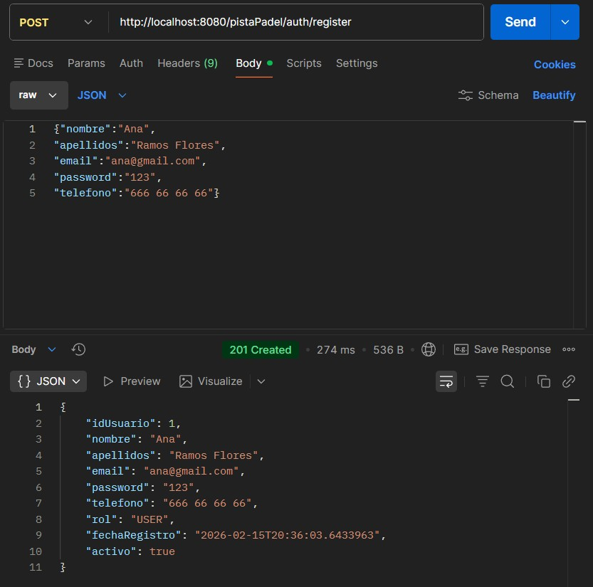
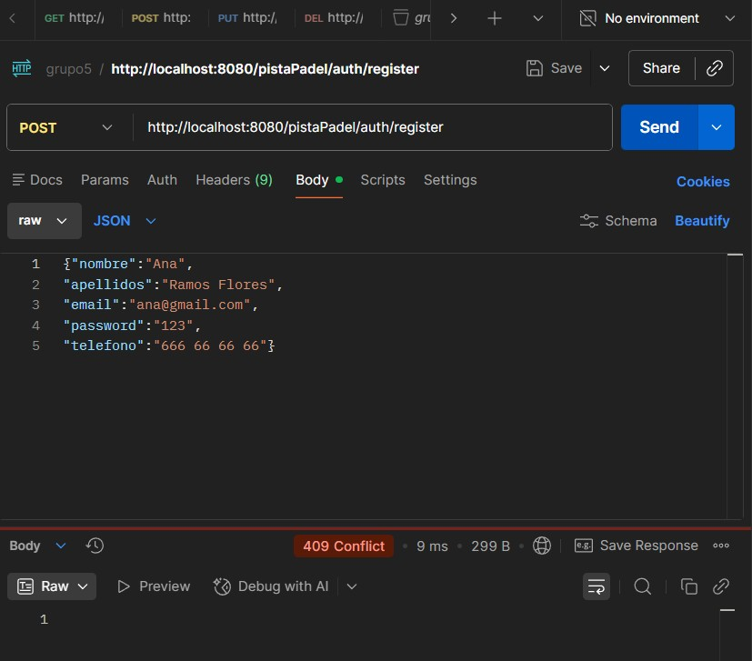
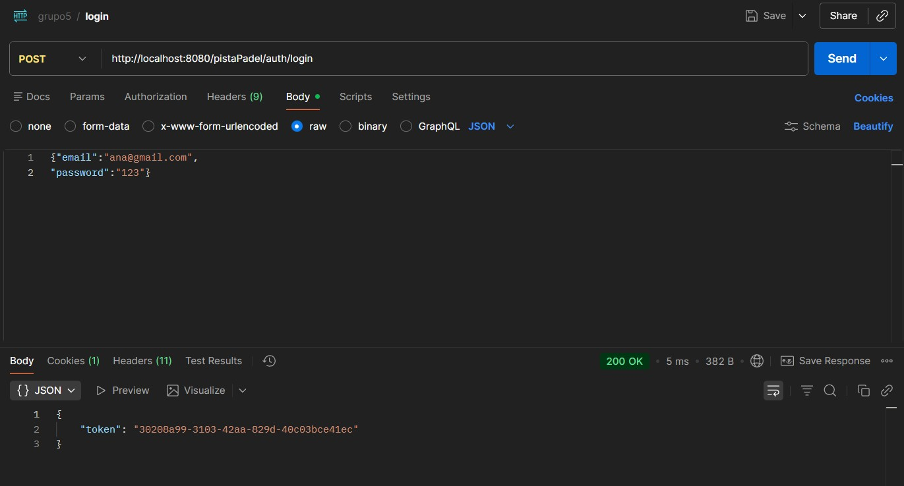
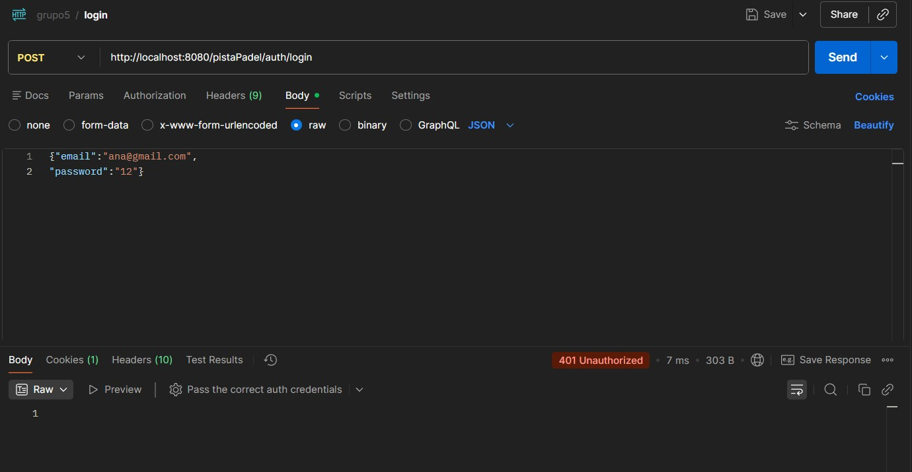
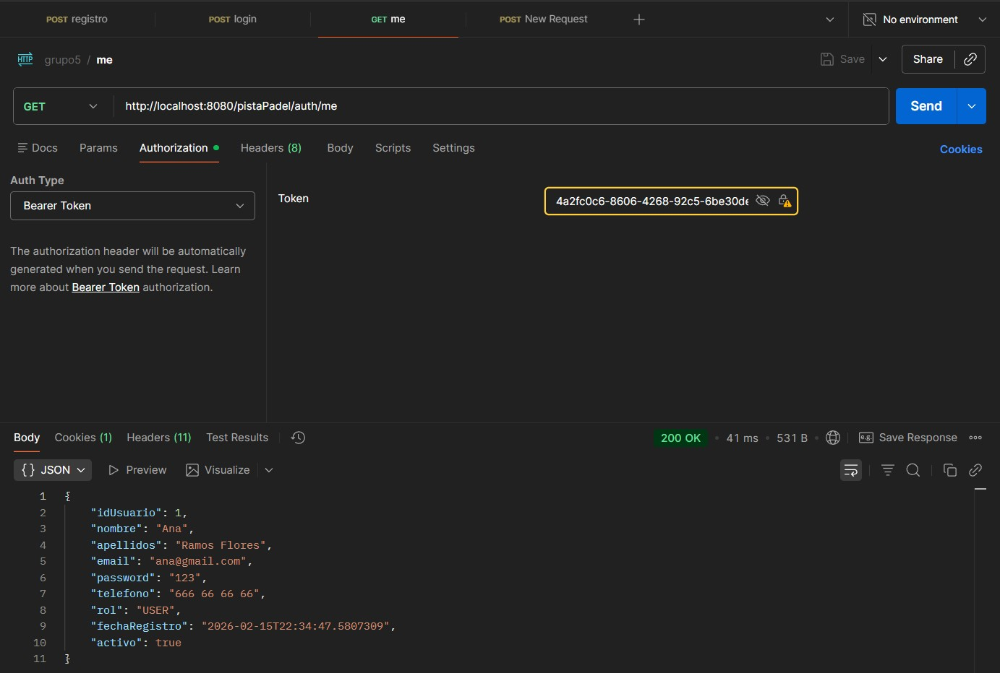
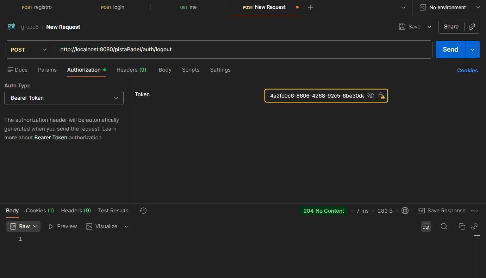
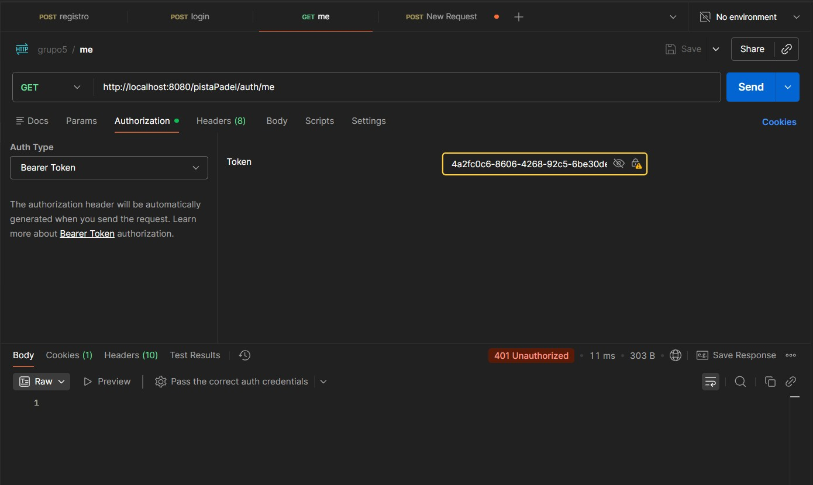
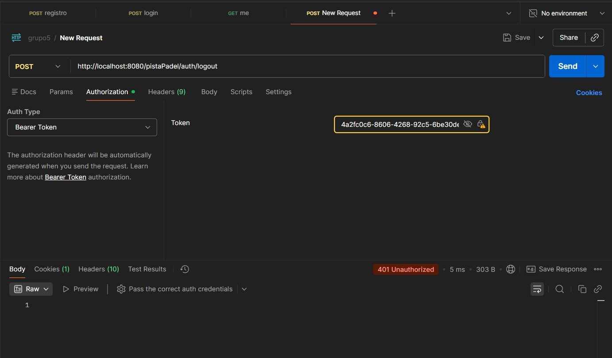

# g5-project
Final Project of PAT by group 5: Felicia Huynh, Antonio Lafont, Yago Méndez, Martina Ortiz y Ana Mei Li Ramos

---

## Base (Felicia)

I created a record named Pista and added endpoints to the REST controller. In the class `ConfigSeguridad` I created two possible user authentications: USER and ADMIN which have different authorities to change details in the different courts.

**Description of written code**
I created a record named Pista and added endpoints to the REST controller. In the class `ConfigSeguridad` I created two possible user authentications: USER and ADMIN which have different authorities to change details in the different courts. I also created to types of tests where creating a pista is ok and one in incorrect. 

<details>
<summary><strong>Description of the endpoints from my part</strong></summary>
<table border="1" cellpadding="10" cellspacing="0">
  <thead>
    <tr>
      <th>MÉTODO</th>
      <th>RUTA</th>
      <th>DESCRIPCIÓN</th>
      <th>RESPUESTAS (mínimas)</th>
    </tr>
  </thead>
  <tbody>
    <tr>
      <td><strong>POST</strong></td>
      <td><code>/pistaPadel/courts</code></td>
      <td>(ADMIN) Crear pista (nombre,
				ubicación, precio/hora,
				activa…).
	  </td>
      <td>201, 400, 401, 403, 409 (nombre duplicado)</td>
    </tr>
    <tr>
      <td><strong>GET</strong></td>
      <td><code>/pistaPadel/courts</code></td>
      <td>Listar pistas (filtro opcional active=true/false).</td>
      <td>200 ok</td>
    </tr>
    <tr>
      <td><strong>GET</strong></td>
      <td><code>/pistaPadel/courts/{courtId}</code></td>
      <td>Obtener detalle de una pista.</td>
      <td>204 ok, 404</td>
    </tr>
    <tr>
      <td><strong>PATCH</strong></td>
      <td><code>/pistaPadel/courts/{courtId}</code></td>
      <td>(ADMIN) Modificar pista (precio, activa, etc.).</td>
      <td>200 ok, 400 Bad request, 401 no autenticado, 403 Forbidden Error, 404</td>
    </tr>
    <tr>
      <td><strong>DELETE</strong></td>
      <td><code>/pistaPadel/courts/{courtId}</code></td>
      <td>(ADMIN) Eliminar pista (o desactivar).</td>
      <td>204, 401, 403, 404, 409 (si hay reservas futuras, si queréis imponer regla)</td>
    </tr>
  </tbody>
</table>


<summary><strong>🔹 Record: Pista (Características y Restricciones)</strong></summary>
**Características:**
- `idPista`:Identificador único de la pista.
- `nombre`: Nombre identificativo de la pista (ej. “Pista 1”).
- `ubicacion`: Ubicación o descripción física.
- `precioHora`: Precio de la pista por hora.
- `activa`: Indica si la pista está disponible para reservas.
- `fechaAlta`: Fecha de creación de la pista.


**Restricciones:**
- El nombre de la pista debe ser **único**.
- Un pista puede tener **0..n** reservas.
- No se puede reservar una pista inactiva..

</details>


<details>
<summary><strong>Integration test</strong></summary>

> I created two test for **POST /pistaPadel/courts/**. I also created a example pista to check the creaPistaOkTest is going through. I check this by double checking with the name of the pista that I created with the name "Madrid central 1".
```java
@Test
    void creaPistaOkTest() throws Exception{
        Pista pista = new Pista(
                        1,
                        "Madrid central 1",
                        "Madrid",
                        10,
                        true,
                        "2026-02-15");

        mockMvc.perform(post("/pistaPadel/courts")
                        .contentType(String.valueOf(MediaType.APPLICATION_JSON))
                        .content(objectMapper.writeValueAsString(pista)))
                .andExpect(status().isCreated())
                .andExpect(jsonPath("$.nombre").value("Madrid central 1"));
    }
    @Test
    void creaPistaIncorrectoTest() throws Exception{
        mockMvc.perform(post("/pistaPadel/courts")
                    .contentType(String.valueOf(MediaType.APPLICATION_JSON))
                    .content(String.valueOf(pista)))
                .andExpect(status().isBadRequest());
    }
```

</details>


---

## Contribuciones combinadas

### Ana (integrada sobre Felicia)

## 1. Cambios realizados en ANA_BRANCH

<details>
<summary><strong>📌 1.1. Descripción de mi parte</strong></summary>

Mi parte trataba de la **Autenticación + detalle de usuario (errores tipo 401/403)**
Tenía los siguientes endpoints a desarrollar:

<table border="1" cellpadding="10" cellspacing="0">
  <thead>
    <tr>
      <th>MÉTODO</th>
      <th>RUTA</th>
      <th>DESCRIPCIÓN</th>
      <th>RESPUESTAS (mínimas)</th>
    </tr>
  </thead>
  <tbody>
    <tr>
      <td><strong>POST</strong></td>
      <td><code>/pistaPadel/auth/register</code></td>
      <td>Registrar usuario (rol USER por defecto)</td>
      <td>201 creado, 400 datos inválidos, 409 email ya existe</td>
    </tr>
    <tr>
      <td><strong>POST</strong></td>
      <td><code>/pistaPadel/auth/login</code></td>
      <td>Login y obtención de token (sesión)</td>
      <td>200 ok, 400 request inválida, 401 credenciales incorrectas</td>
    </tr>
    <tr>
      <td><strong>POST</strong></td>
      <td><code>/pistaPadel/auth/logout</code></td>
      <td>Logout (invalidar sesión/tokens si aplica)</td>
      <td>204 ok, 401 no autenticado</td>
    </tr>
    <tr>
      <td><strong>GET</strong></td>
      <td><code>/pistaPadel/auth/me</code></td>
      <td>Devuelve el usuario autenticado</td>
      <td>200 ok, 401 no autenticado</td>
    </tr>
    <tr>
      <td><strong>GET</strong></td>
      <td><code>/pistaPadel/users/{userId}</code></td>
      <td>(ADMIN o dueño) Obtener un usuario por id</td>
      <td>200, 401, 403, 404 no existe</td>
    </tr>
  </tbody>
</table>

<details>
<summary><strong>📊 Tabla referencia: HTTP STATUS CODES</strong></summary>

| Código | Descripción |
|--------|-------------|
| 200 | OK |
| 201 | Created |
| 204 | No Content |
| 400 | Bad Request |
| 401 | Unauthorized |
| 403 | Forbidden |
| 409 | Conflict |

</details>

</details>

## 1.2. Desarrollo de mi parte

Tomando como base el código que subió mi compañera Felicia, partí creando el **record** `Usuario`.

<details>
<summary><strong>🔹 Record: Usuario (Características y Restricciones)</strong></summary>
**Características:**
- `idUsuario`: Identificador único del usuario.
- `nombre`: Nombre del usuario.
- `apellidos`: Apellidos del usuario.
- `email`: Correo electrónico (único en el sistema).
- `password`: Contraseña cifrada.
- `telefono`: Teléfono de contacto.
- `rol`: Rol del usuario en el sistema. *Valores posibles: USER, ADMIN.*
- `fechaRegistro`: Fecha y hora de alta en el sistema.
- `activo`: Indica si el usuario está activo o deshabilitado.

**Restricciones:**
- El email debe ser **único**.
- Un usuario puede tener **0..n** reservas.
- Solo los usuarios con **rol ADMIN** pueden **gestionar pistas**.

</details>

## 1. Cambios realizados en ANA_BRANCH

<details>
<summary><strong>📌 1.1. Descripción de mi parte</strong></summary>

Mi parte trataba de la **Autenticación + detalle de usuario (errores tipo 401/403)**

Tenía los siguientes endpoints a desarrollar:

<table border="1" cellpadding="10" cellspacing="0">
  <thead>
    <tr>
      <th>MÉTODO</th>
      <th>RUTA</th>
      <th>DESCRIPCIÓN</th>
      <th>RESPUESTAS (mínimas)</th>
    </tr>
  </thead>
  <tbody>
    <tr>
      <td><strong>POST</strong></td>
      <td><code>/pistaPadel/auth/register</code></td>
      <td>Registrar usuario (rol USER por defecto)</td>
      <td>201 creado, 400 datos inválidos, 409 email ya existe</td>
    </tr>
    <tr>
      <td><strong>POST</strong></td>
      <td><code>/pistaPadel/auth/login</code></td>
      <td>Login y obtención de token (sesión)</td>
      <td>200 ok, 400 request inválida, 401 credenciales incorrectas</td>
    </tr>
    <tr>
      <td><strong>POST</strong></td>
      <td><code>/pistaPadel/auth/logout</code></td>
      <td>Logout (invalidar sesión/tokens si aplica)</td>
      <td>204 ok, 401 no autenticado</td>
    </tr>
    <tr>
      <td><strong>GET</strong></td>
      <td><code>/pistaPadel/auth/me</code></td>
      <td>Devuelve el usuario autenticado</td>
      <td>200 ok, 401 no autenticado</td>
    </tr>
    <tr>
      <td><strong>GET</strong></td>
      <td><code>/pistaPadel/users/{userId}</code></td>
      <td>(ADMIN o dueño) Obtener un usuario por id</td>
      <td>200, 401, 403, 404 no existe</td>
    </tr>
  </tbody>
</table>

<details>
<summary><strong>📊 Tabla referencia: HTTP STATUS CODES</strong></summary>

| Código | Descripción |
|--------|-------------|
| 200 | OK |
| 201 | Created |
| 204 | No Content |
| 400 | Bad Request |
| 401 | Unauthorized |
| 403 | Forbidden |
| 409 | Conflict |

</details>

</details>

## 1.2. Desarrollo de mi parte

Tomando como base el código que subió mi compañera Felicia, partí creando el **record** `Usuario`.

---

<details>
<summary><strong>🔹 Record: Usuario (Características y Restricciones)</strong></summary>

**Características:**
- `idUsuario`: Identificador único del usuario.
- `nombre`: Nombre del usuario.
- `apellidos`: Apellidos del usuario.
- `email`: Correo electrónico (único en el sistema).
- `password`: Contraseña cifrada.
- `telefono`: Teléfono de contacto.
- `rol`: Rol del usuario en el sistema. *Valores posibles: USER, ADMIN.*
- `fechaRegistro`: Fecha y hora de alta en el sistema.
- `activo`: Indica si el usuario está activo o deshabilitado.

**Restricciones:**
- El email debe ser **único**.
- Un usuario puede tener **0..n** reservas.
- Solo los usuarios con **rol ADMIN** pueden **gestionar pistas**.

**Código:**

```java
public record Usuario(
        @NonNull
        Long idUsuario,
        @NotBlank(message = "El nombre es obligatorio")
        String nombre,
        String apellidos,
        @Email(message = "El formato del email es incorrecto")
        @NotBlank(message = "El email es obligatorio")
        String email,
        @NotBlank(message = "La contraseña es obligatoria")
        String password,
        String telefono,
        NombreRol rol,
        LocalDateTime fechaRegistro,
        Boolean activo)
{}
```

</details>

---

<details>
<summary><strong>🔹 Implementación POST: Registro</strong></summary>

Implementación del endpoint de registro con validaciones:

```java
private Logger logger = LoggerFactory.getLogger(getClass());

private final Map<String, Usuario> usuarios = new ConcurrentHashMap<>(); // guardo los usuarios por email
private final Map<Long, Usuario> usuariosporId = new ConcurrentHashMap<>(); // guardo los usuarios por id
private final AtomicLong idUsuarioSeq = new AtomicLong(1);

@PostMapping("/pistaPadel/auth/register")
    @ResponseStatus(HttpStatus.CREATED)
    public Usuario registrarUsuario(@Valid @RequestBody Usuario usuarioNuevo, BindingResult bindingResult) {
        logger.info("Intento de registro para email={}", usuarioNuevo.email());
        logger.debug("Usurario recibido: nombre={}, apellidos={}, telefono={}",
                usuarioNuevo.nombre(), usuarioNuevo.apellidos(), usuarioNuevo.telefono());
        if (bindingResult.hasErrors()) {
            // Error 400 --> datos inválidos
            logger.error("Datos inválidos");
            throw new ExcepcionUsuarioIncorrecto(bindingResult);
        }
        if (usuarios.get(usuarioNuevo.email())!= null) {
            // Error 409 --> email ya existe
            logger.error("este email ya existe");
            throw new ResponseStatusException(HttpStatus.CONFLICT, "email ya existe");
        }

    // Generar id en servidor
    long id = idUsuarioSeq.getAndIncrement();

    Usuario u = new Usuario(
            id,
            usuarioNuevo.nombre(),
            usuarioNuevo.apellidos(),
            usuarioNuevo.email(),
            usuarioNuevo.password(),
            usuarioNuevo.telefono(),
            NombreRol.USER, // rol por defecto
            java.time.LocalDateTime.now(),
            true
    );

    usuariosporId.put(id, u);
    usuarios.put(u.email(), u);

    logger.info("Usuario registrado correctamente id={} email={}", id, usuarioNuevo.email());
    // Devuelve 201 con un DTO de salida SIN password
    return u;
}
```

<details>
<summary>📸 Ejemplos de prueba</summary>

**Primer intento - Exitoso:**
<div align="center">
    
</div>

**Segundo intento - Fallo (mismo email):**
<div align="center">
    
</div>

</details>

</details>

---

<details>
<summary><strong>🔹 Cambios en ConfigSeguridad</strong></summary>

Realicé cambios en la función `configuracion()` para abrir y cerrar los endpoints al público, permitiendo separar los que requieren autenticación de los públicos:

```java
@Bean
public SecurityFilterChain configuracion(HttpSecurity http) throws Exception {
    http
            // Para API: puedes desactivar CSRF completamente o restringirlo a tu ruta de API
            .csrf(csrf -> csrf.disable())
            .csrf(csrf -> csrf.ignoringRequestMatchers("/pistaPadel/**"))

            .authorizeHttpRequests(auth -> auth
                    // === ENDPOINTS PÚBLICOS (POST - registro, GET - healthcheck)===
                    .requestMatchers("/pistaPadel/auth/register").permitAll()
                    .requestMatchers("/pistaPadel/health").permitAll()

                    // === TODO LO DEMÁS PROTEGIDO ===
                    .anyRequest().authenticated()
            )

            // httpBasic y/o formLogin para probar rápidamente
            .httpBasic(Customizer.withDefaults())
            .formLogin(Customizer.withDefaults());

    return http.build();
}
```

</details>

---

<details>
<summary><strong>🔹 Implementación POST: Login/Token</strong></summary>

Intenté implementar este endpoint pasándole al método el record `Usuario`; sin embargo, como éste cuenta con muchas anotaciones de validación (`@NotBlank`), ponerlo seguido de `@RequestBody` fallará (error 400) por no introducir todos los campos.

**Problema:** Para login solo se introduce email y contraseña, no todos los campos del Usuario.

**Solución:** Usar **DTOs** (Data Transfer Objects).

<details>
<summary>ℹ️ ¿Qué son los DTOs y por qué usarlos aquí?</summary>

**DTOs (Data Transfer Objects)** son objetos simples diseñados solo para transportar datos entre capas. En este caso:

- **Ventaja 1:** Validación independiente. El DTO `LoginRequest` solo valida email y contraseña.
- **Ventaja 2:** Seguridad. No expones todos los campos del Usuario en la solicitud.
- **Ventaja 3:** Flexibilidad. Puedes tener diferentes DTOs para diferentes casos de uso.
- **Ventaja 4:** El `@Valid` funciona correctamente porque el DTO es un JavaBean.

</details>

**Código:**
```java
// Almacén de sesiones (token -> idUsuario)
    private final Map<String, Long> tokenToUserId = new ConcurrentHashMap<>();

    // DTO de entrada
    public record LoginRequest(
            @Email(message = "Email inválido")
            @NotBlank(message = "Email requerido")
            String email,
            @NotBlank(message = "Password requerida")
            String password
    ) {}

    // DTO de salida
    public record LoginResponse(String token) {}

    @PostMapping("/pistaPadel/auth/login")
    public LoginResponse login(@Valid @RequestBody LoginRequest req) {
        /*ERROR 401 - CREDENCIALES INCORRECTAS*/
        // 1) ¿Existe el usuario?
        Usuario u = usuarios.get(req.email());
        if (u == null) {
            // 401 (no 404) para no filtrar existencia de cuentas
            throw new ResponseStatusException(HttpStatus.UNAUTHORIZED, "credenciales incorrectas");
        }

        // 2) Comprobación password
        boolean ok = req.password().equals(u.password());
        if (!ok) {
            throw new ResponseStatusException(HttpStatus.UNAUTHORIZED, "credenciales incorrectas");
        }

        // 3) Generar token (UUID) y guardarlo en memoria --> Sólo permito un inicio de sesión por usuario
        String tokenNuevo = UUID.randomUUID().toString();
        String TokenViejo = userIdToToken.put(u.idUsuario(), tokenNuevo);
        if (TokenViejo != null) tokenToUserId.remove(TokenViejo); // revoca la sesión anterior
        tokenToUserId.put(tokenNuevo, u.idUsuario());

        return new LoginResponse(tokenNuevo);
    }

    // Función para extraer "Bearer <token>"
    private String extractBearer(String authHeader) {
        if (authHeader == null) return null;
        String prefix = "Bearer ";
        return authHeader.startsWith(prefix) ? authHeader.substring(prefix.length()).trim() : null;
    }
```

**Más cambios en ConfigSeguridad: autorizo el login**
```java
.authorizeHttpRequests(auth -> auth
                        // === ENDPOINTS PÚBLICOS (POST - registro, GET - healthcheck, ...)===
                        .requestMatchers("/pistaPadel/auth/register").permitAll()
                        .requestMatchers("/pistaPadel/health").permitAll()
                        .requestMatchers("/pistaPadel/auth/login").permitAll()
                        

                        // === TODO LO DEMÁS PROTEGIDO ===
                        .anyRequest().authenticated()
                )
```

<details>
<summary>📸 Ejemplos de prueba</summary>

**Primer intento - Exitoso:**
<div align="center">
    
</div>

**Segundo intento - Fallo (401):**
<div align="center">
    
</div>

</details>

</details>

---
<details>
<summary><strong>🔹 Implementación POST: Logout</strong></summary>
Lo que hace este endpoint es eliminar el token que se haya creado al registrarse+logear in un usuario

**Código:**
```java
@PostMapping("/pistaPadel/auth/logout")
    @ResponseStatus(HttpStatus.NO_CONTENT)
    public void logout(@RequestHeader(name = "Authorization", required = false) String authHeader) {
        String token = extractBearer(authHeader);
        if (token == null || !tokenToUserId.containsKey(token)) {
            throw new ResponseStatusException(HttpStatus.UNAUTHORIZED, "no autenticado");
        }

        Long userId = tokenToUserId.remove(token);

        // Limpia el índice inverso SOLO si coincide el token actual
        if (userId != null) {
            userIdToToken.computeIfPresent(userId, (k, v) -> v.equals(token) ? null : v);
        }
    }
```

</details>

---
<details>
<summary><strong>🔹 Implementación GET: me</strong></summary>
Nos devuelve nuestro usuario según el token que le proporcionemos, de esta forma:

```
Auth Typr: Bearer Token
Token: pega_aquí_tu_token
```
<small>*Dentro de la pestaña Authorization de Postman*</small>

**Código:**
```java
@GetMapping("/pistaPadel/auth/me")
    public Usuario me(@RequestHeader(name = "Authorization", required = false) String authHeader) {
        logger.debug("Authorization header recibido: {}", authHeader);
        String token = extractBearer(authHeader);
        logger.debug("Token extraído: {}", token);
        if (token == null) throw new ResponseStatusException(HttpStatus.UNAUTHORIZED, "no autenticado");

        Long userId = tokenToUserId.get(token);
        logger.debug("userId buscado por token: {}", userId);
        if (userId == null) throw new ResponseStatusException(HttpStatus.UNAUTHORIZED, "no autenticado");

        Usuario u = usuariosporId.get(userId);
        if (u == null) {
            tokenToUserId.remove(token);
            userIdToToken.computeIfPresent(userId, (k, v) -> v.equals(token) ? null : v);
            throw new ResponseStatusException(HttpStatus.UNAUTHORIZED, "no autenticado");
        }
        return u;
    }
```

**Cambio again ConfigSeguridad:**
```java
.authorizeHttpRequests(auth -> auth
                        // === ENDPOINTS PÚBLICOS (POST - registro, GET - healthcheck, ...)===
                        .requestMatchers("/pistaPadel/auth/register").permitAll()
                        .requestMatchers("/pistaPadel/auth/login").permitAll()
                        .requestMatchers("/pistaPadel/auth/me").permitAll()
                        .requestMatchers("/pistaPadel/auth/logout").permitAll()  // <-- hasta tener filtro
                        .requestMatchers("/pistaPadel/health").permitAll()

                        // === TODO LO DEMÁS PROTEGIDO ===
                        .anyRequest().authenticated()
                )
```

</details>

---

<details>
<summary>📸 Ejemplos de GET me + logout</summary>

**Primer intento GET - ME - Exitoso:**
<div align="center">
    
</div>

**Primer intento POST - LOGOUT -  Exitoso:**
<div align="center">
    
</div>

**Segundo intento GET - ME - Fallo (401):**
<div align="center">
    
</div>

**Segundo intento POST - LOGOUT - Fallo (401):**
<div align="center">
    
</div>

</details>

**LINK POSTMAN:** https://anaramosicai-1242651.postman.co/workspace/Ana-Ramos's-Workspace~150adb93-51ba-4917-8bb9-8a85a0e683a5/collection/51611950-8ea4e773-4ab0-4e65-9f2b-6e444286a9e0?action=share&creator=51611950

### Martina (integrada sobre la combinación actual)

## Cambios realizados en Martina_branch:

En primer lugar, mi parte irá principalmente enfocada al tratado de Usuario, en conjunto con la parte de Ana (autorización + usuario). Me encargaré de la realización de los cuatro endpoint siguientes:

- **GET** /pistaPadel/users
- **GET** /pistaPadel/users/{userId}
- **PATCH** /pistaPadel/users/{userId}
- **GET** /pistaPadel/health

<details>
<summary><strong>TRATADO Y CREACIÓN DE CLASES</strong></summary>

En conjunto con Ana, se crea el record Usuario y dentro de este se añaden una serie de validaciones. Copio también las clases `Rol` y `NombreRol`, las cuales necesitaré cuando trabaje con mis otras clases. Además de `ConfigSeguridad`, clase que me permitirá habilitar los roles (principalmente con el que trabajo, que es ADMIN) y controlar el acceso a los endpoint mediante `@PreAuthorize`.

**IMPORTANTE:** De cara al POST de registro de Usuario, en el body, el usuario se registrará pero no puede él determinar su ID ni su rol (el cual será siempre USER en su caso), de eso se encargará el servidor.

</details>

## Cambios realizados en Martina_branch:
En primer lugar, mi parte irá principalmente enfocada al tratado de Usuario, en conjunto con la parte de Ana (autorización + usuario). Me encargaré de la realización de los cuatro endpoint siguientes:

- **GET** /pistaPadel/users
- **GET** /pistaPadel/users/{userId}
- **PATCH** /pistaPadel/users/{userId}
- **GET** /pistaPadel/health

<details>
<summary><strong>TRATADO Y CREACIÓN DE CLASES</strong></summary>

En conjunto con Ana, se crea el record Usuario y dentro de este se añaden una serie de validaciones. Por ejemplo, con '@Email' logramos validar que el formato de los correos introducidos son correctos.

Por otro lado, tomando como base la clase 'ControladorREST' de 'felicia_branch', comenzaré a añadir cada endpoint de los nombrados arriba.
Copio también las clases Rol y NombreRol, las cuales necesitaré cuando trabaje con mis otras clases. Además de 'ConfigSeguridad', clase que me permitirá habilitar los roles (principalmente con el que trabajo, que es ADMIN) y controlar el acceso a los endpoint mediante '@PreAuthorize'.

**IMPORTANTE:** De cara a aquel que se encargue de hacer el POST de registro de Usuario, en el body, el usuario se registrará pero no puede él determinar su ID ni su rol (el cual será siempre USER en su caso), de eso se encargará el servidor.

</details>

<details>
<summary><strong>TRATADO DE DEPENDENCIAS</strong></summary>

* Añado la siguiente dependencia para poder usar la Preautorización de roles y la seguridad:
```java
      <dependency>
			<groupId>org.springframework.boot</groupId>
			<artifactId>spring-boot-starter-security</artifactId>
		</dependency>
```

* Además de la dependencia para realizar validaciones:
```java
<dependency>
  <groupId>org.springframework.boot</groupId>
  <artifactId>spring-boot-starter-validation</artifactId>
</dependency>
```
Con ello aseguro poder cumplir en el futuro con las condiciones que me impongan y las validaciones que se usaron en el record de Usuario.

* La dependencia para la parte de test que he decidido añadir:

```java
<dependency>
    <groupId>org.springframework.security</groupId>
    <artifactId>spring-security-test</artifactId>
    <scope>test</scope>
</dependency>

```

</details>

<details>
<summary><strong>IMPLEMENTACIÓN GET DE USUARIOS</strong></summary>

En este primer GET se pide el Listado de usuarios, el cual, por facilidad, se devolverá ordenado en nombre alfabético de apellido (aunque podría haberse devuelto por fecha de registro).

--> Lo de por páginas era opcional, si diera tiempo, añadirlo.

En cuanto a las respuestas esperadas, este método puede devolvernos un 200 (indicador de que se efectuó bien), un 401 (indicador de que no se está autorizado) o un 403 (indicador de que no tenemos permisos y por tanto se nos prohibe acceder al método).
Si el GET devuelve un objeto, tendremos como respuesta el 200.
Si se intenta acceder sin autenticar, Spring Security se encargará de devolver el 401. 
Si intentamos acceder desde otro rol que no sea ADMIN, con '@PreAuthorize("hasRole('ADMIN')")' logramos que Spring Security devuelva el aviso 403. 
Spring Security se ejecuta antes de la llamada del endpoint, cuando llega la petición API, se ejecutan filtros de seguridad antes de acceder como tal al endpoint.

De cara al manejo de errores 401 y 403, podemos modificar su mensaje en lugar de trabajar con lo predeterminado de Spring, añadiendo a nuestra clase 'ConfigSeguridad' el siguiente código:

```java
// === MANEJO DE ERRORES 401 Y 403 ===
                // ¿Qué sucede cuando...? (Aplicado a todos los endpoint protegidos)
                .exceptionHandling(ex -> ex
                        // Usuario NO autenticado → 401
                        .authenticationEntryPoint((request, response, authException) ->
                                response.sendError(HttpServletResponse.SC_UNAUTHORIZED, "401 - No autenticado") )
                        // Usuario autenticado pero sin permisos → 403
                        .accessDeniedHandler((request, response, accessDeniedException) ->
                                response.sendError(HttpServletResponse.SC_FORBIDDEN,
                                        "403 - Acceso denegado")
                        )
                )
```

* Foto demostración de funcionamiento:


</details>

<details>
<summary><strong>IMPLEMENTACIÓN GET POR ID DE USUARIO</strong></summary>

Creación del segundo GET. (@GetMapping("/pistaPadel/users/{userId}"))

* Fotos demostración de funcionamiento:


</details>

<details>
<summary><strong>IMPLEMENTACIÓN PATCH DE USUARIO</strong></summary>

Creación del endpoint con PATCH que nos permita actualizar datos dado un Id de usuario.

Para el PATCH, en primer lugar, se ha de comprobar que el usuario que se nos pide actualizar existe y que el email que nos dan no está repetido en los registros.
Bloqueo aquellos campos que quiero que permanezcan inalterables (idUsuario, rol y fechaRegistro) y procedo a crear el nuevo usuario actualizado:
```java
Usuario actualizado;
        try{
            actualizado = new Usuario(
                    user.idUsuario(),
                    cambios.containsKey("nombre") ? (String) cambios.get("nombre") : user.nombre(),
                    cambios.containsKey("apellidos") ? (String) cambios.get("apellidos") : user.apellidos(),
                    cambios.containsKey("email") ? (String) cambios.get("email") : user.email(),
                    cambios.containsKey("password") ? (String) cambios.get("password") : user.password(),
                    cambios.containsKey("telefono") ? (String) cambios.get("telefono") : user.telefono(),
                    user.rol(),
                    user.fechaRegistro(),
                    cambios.containsKey("activo") ? (Boolean) cambios.get("activo") : user.activo()
            );

        } catch (IllegalArgumentException e){
            throw new ResponseStatusException(HttpStatus.BAD_REQUEST,
                    "Campo inválido");
        }
```

Además, como previamente se estaba trabajando con dos HashMap (uno por email y otro por id), actualizo ambos con los nuevos datos para que haya una sincronización completa.

Una vez hecho esto, procedemos a comprobar el funcionamiento del PATCH

* Foto demostración del funcionamiento:


</details>

<details>
<summary><strong>IMPLEMENTACIÓN GET PARA HEALTHCHECK</strong></summary>

Este endpoint es realmente sencillo y se usa principalmente por otros sistemas para ver si nuestra aplicación está viva y responde funcionando correctamente.

Su implementación es así de sencilla:

```java
@GetMapping("/pistaPadel/health")
    public Map<String, String> health(){
        return Map.of("status", "ok");
    }
```

* Foto demostración del funcionamiento:


</details>

<details>
<summary><strong>INTEGRATION TEST</strong></summary>

> Para esta parte, he de probar que las respuestas que se dan al realizar el **GET /pistaPadel/users/{userId}** son las esperadas.
En mi caso, probaré dicho endpoint en lugar del GET a todos los usuarios por optimizar el tiempo y porque decidiré asumir como primer "approach" que si puedo recuperar un usuario mediante el GET, podré recuperar los demás.
```java
@Test
    @WithMockUser(roles = "ADMIN")
    void obtenerUsuarioporIdTest_OK() throws Exception {

        // Defino un usuario cualquiera de tipo String (así funciona MockMvc)
        String usuario = """
                {
                "nombre": "Martina",
                "apellidos": "Ortiz",
                "email": "mod@test.com",
                "password": "123",
                "telefono": "123456789"
                }
                """;
        // Simulo el POST previo al GET
        mockMvc.perform(post("/pistaPadel/auth/register")
                        .contentType(MediaType.APPLICATION_JSON)
                        .content(usuario))
                .andExpect(status().isCreated());
        // Simulo el GET al id 1:
        mockMvc.perform(get("/pistaPadel/users/1"))
                .andExpect(status().isOk())
                // Ademas de verificar el 200, verifico que mi devuelve mis datos
                .andExpect(jsonPath("$.nombre").value("Martina"))
                .andExpect(jsonPath("$.email").value("mod@test.com"));
        // Para evitar ir campo por campo, verifico solo dos, los mas clave*/

    }

    @Test
    @WithMockUser(roles = "ADMIN")
    void obtenerUsuarioporId_NoExistente() throws Exception{
        // Para verificar el error 404
        mockMvc.perform(get("/pistaPadel/users/33"))
                .andExpect(status().isNotFound());
    }

    @Test
    @WithMockUser(roles = "USER")
    void obtenerUsuarioporId_SinPermiso() throws Exception{
        mockMvc.perform(get("/pistaPadel/users/1"))
                .andExpect(status().isForbidden());
    }
```

</details>

## Antonio

**Mi parte:** CRUD completo de **Reservas** + creación del record `Reserva`  
**Endpoints implementados:**

<table border="1" cellpadding="10" cellspacing="0">
  <thead>
    <tr>
      <th>MÉTODO</th>
      <th>RUTA</th>
      <th>DESCRIPCIÓN</th>
      <th>RESPUESTAS (mínimas)</th>
      <th>ROLES REQUERIDOS</th>
    </tr>
  </thead>
  <tbody>
    <tr>
      <td><strong>POST</strong></td>
      <td><code>/pistaPadel/reservations</code></td>
      <td>Crear una nueva reserva</td>
      <td>201 Created, 400 Bad Request, 404 Pista no existe, 409 Slot ocupado</td>
      <td>USER</td>
    </tr>
    <tr>
      <td><strong>GET</strong></td>
      <td><code>/pistaPadel/reservations/{reservationId}</code></td>
      <td>Obtener detalle de una reserva</td>
      <td>200 OK, 401 Unauthorized, 403 Forbidden, 404 Not Found</td>
      <td>USER o ADMIN</td>
    </tr>
    <tr>
      <td><strong>PATCH</strong></td>
      <td><code>/pistaPadel/reservations/{reservationId}</code></td>
      <td>Reprogramar (cambiar horario) una reserva</td>
      <td>200 OK, 400 Bad Request, 404 Not Found, 409 Slot ocupado</td>
      <td>USER o ADMIN</td>
    </tr>
    <tr>
      <td><strong>DELETE</strong></td>
      <td><code>/pistaPadel/reservations/{reservationId}</code></td>
      <td>Cancelar una reserva</td>
      <td>204 No Content, 401 Unauthorized, 403 Forbidden, 404 Not Found</td>
      <td>USER o ADMIN</td>
    </tr>
    <tr>
      <td><strong>GET</strong></td>
      <td><code>/pistaPadel/admin/reservations</code></td>
      <td>Listado completo de todas las reservas (solo admin)</td>
      <td>200 OK, 401 Unauthorized, 403 Forbidden</td>
      <td>ADMIN</td>
    </tr>
  </tbody>
</table>

<details>
<summary><strong>📌 Resumen de mi contribución</strong></summary>

Partiendo del trabajo de Felicia (pistas), Ana (autenticación) y Martina (gestión avanzada de usuarios), implementé:

- Record `Reserva` con validaciones básicas
- Almacenamiento en memoria con `ConcurrentHashMap<Long, Reserva>`
- Contador incremental para `reservationId`
- Validación de **solapamiento de horarios** en la misma pista (409 Conflict)
- Comprobación de existencia de la pista (404 Not Found)
- Uso de `@PreAuthorize` para restringir acceso según roles
- Manejo de excepciones con `ResponseStatusException` coherente con el resto del equipo

</details>

<details>
<summary><strong>🔹 Record Reserva</strong></summary>

```java
public record Reserva(
        long reservationId,
        @NotNull
        long courtId,
        @NotNull
        String userId,
        @NotNull
        LocalDateTime inicio,
        @NotNull
        LocalDateTime fin
) {}
```
</details>

## Yago


